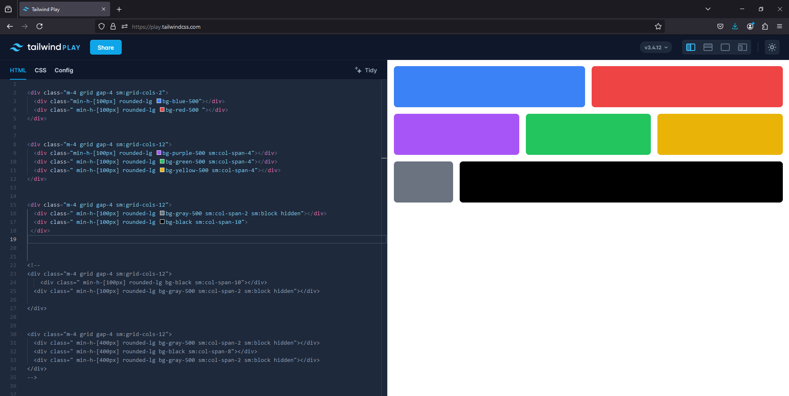
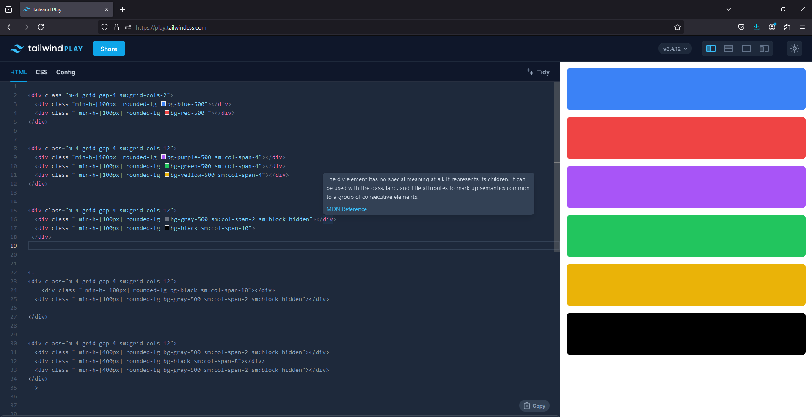
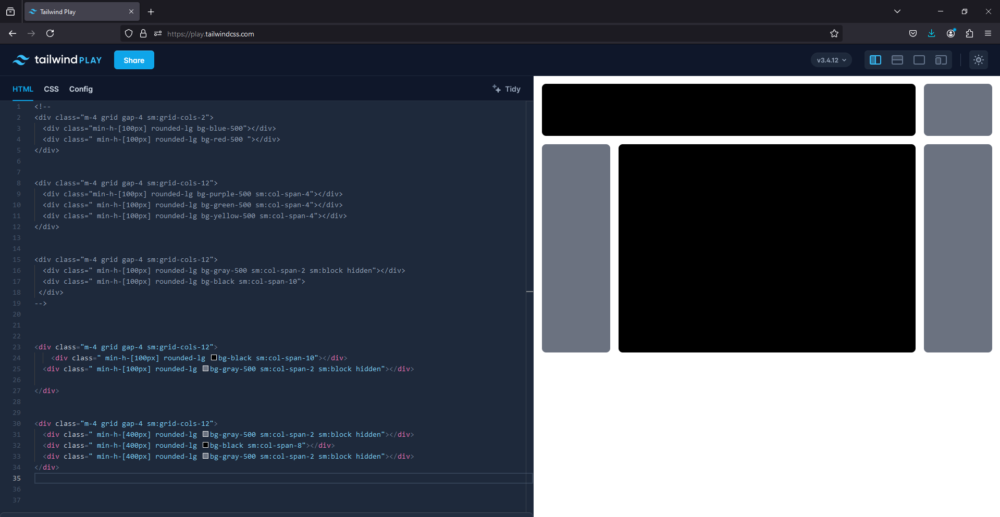
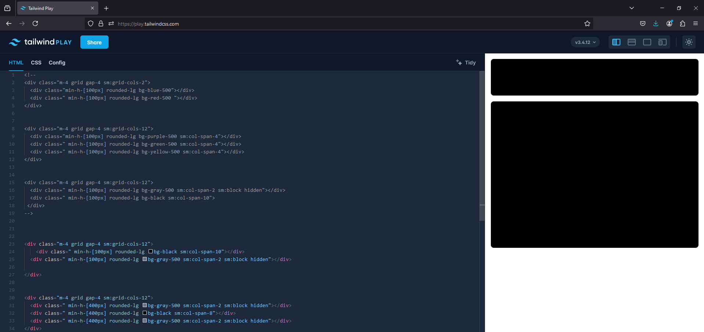

<h1>Layout Design in Tailwind CSS</h1>
 
 
As soon as I dive into the world of Tailwind. I realised it is much optimised way to deal with css in order to make it look simple and clear
 
Often there will be some stands to say that as a framework is good but actual css is one that stills.
 
But each of the ways matter on it's own when it comes to applying in real scenarios and actual doing.
 
 
For the dynamic experience on your own you can check this:- 
  <a href='https://play.tailwindcss.com/7laOXLkE1A' >Click Here !</a>
 
 
So here it is:-

